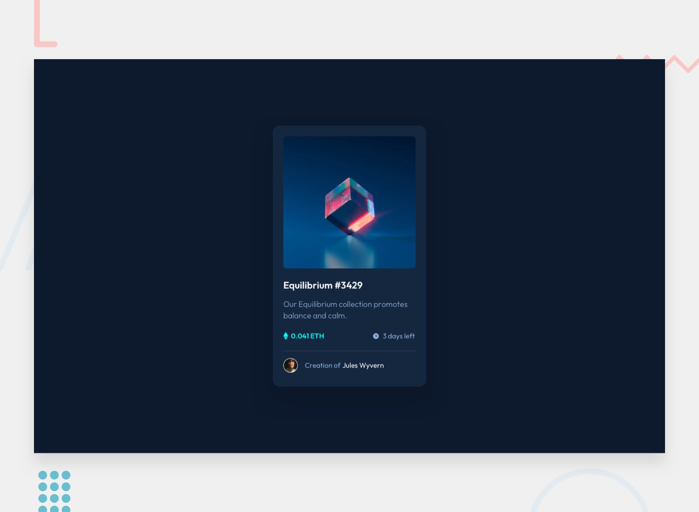

# NFT Preview Card Component

A responsive and interactive **NFT Preview Card Component** built with modern frontend practices.

Built with **React and Tailwind CSS**, focusing on **component structure, styling precision, and hover interactions**.

This project is a solution to a **Frontend Mentor challenge**.

---

## Live Demo

**Live Site:**
https://frontend-mentor-challenges-pmio.vercel.app/

---

## Features

### NFT Card UI

* Clean and modern card layout
* Display of NFT image, title, price, and creator info
* Structured and reusable component design

---

### Hover Interaction

* Overlay effect on image hover
* Smooth transition animations
* Visual feedback for user interaction

---

### User Experience

* Clear visual hierarchy
* Interactive hover states
* Minimal and focused UI design

---

### Responsive Design

* Mobile-first approach
* Fully responsive layout
* Consistent spacing and alignment across screen sizes

---

## Technologies Used

### React / JavaScript

* Functional components
* Component-based architecture

---

### CSS / Tailwind CSS

* Utility-first styling
* Flexbox for layout structure
* Hover and transition effects
* Responsive design utilities

---

## What I Learned

* Creating clean and reusable UI components
* Implementing hover-based interactions
* Managing layout structure with Flexbox
* Improving pixel-perfect design implementation
* Translating design mockups into code

---

## Reflection

This project helped strengthen my understanding of **UI precision and interaction design**, especially in creating **hover overlays and clean card layouts**.

Focusing on small details like spacing, typography, and hover states improved my ability to build **polished and production-ready components**.

---

## Credits

**Coded by:**
[Tuğçe Karakuş](https://github.com/tugcekarakuss)

**Challenge by:**
[Frontend Mentor](https://www.frontendmentor.io)
