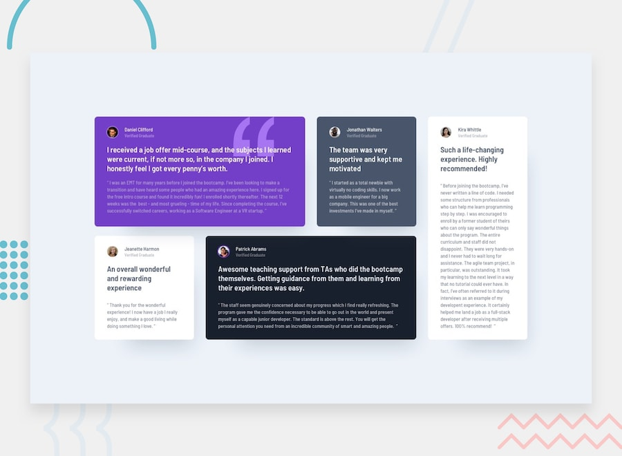
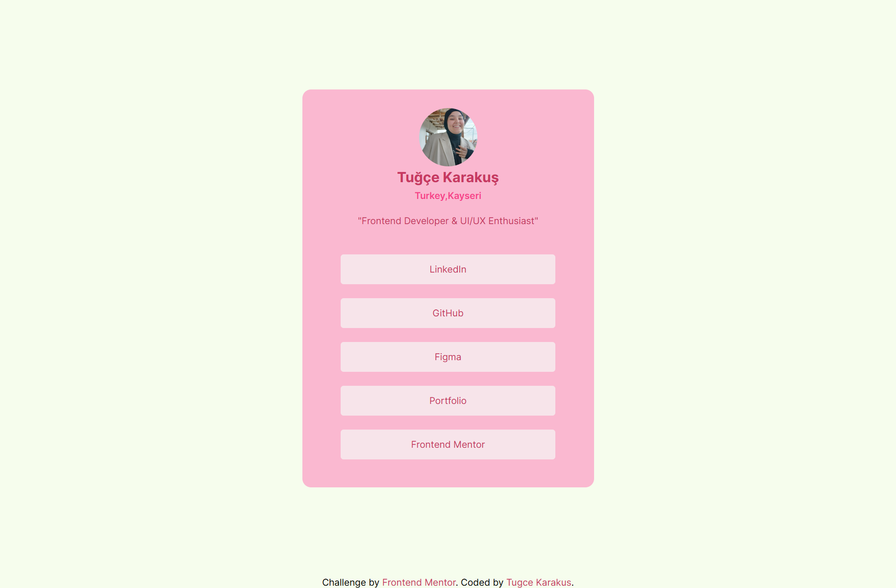

# Frontend Mentor Challenge Projects

This repository contains my completed **Frontend Mentor** mini projects.  
These projects helped me practice HTML, CSS, JavaScript and improve my responsive design skills.

## Projects

<table>

<tr>
<td width="50%" valign="top">

### FAQ Accordion

A responsive FAQ accordion component that allows users to expand and collapse answers. Built with **HTML, CSS, and JavaScript**, focusing on accessibility (ARIA), state toggling, and smooth UI transitions.

→ [Project Folder](./FaqAccordion/) • [Live Demo](https://faqaccordion-three.vercel.app/)

</td>

<td width="50%" valign="top">

### Interactive Rating Component

An interactive rating component that allows users to select a rating from **1 to 5** and submit their feedback. Built with **HTML, CSS, and JavaScript**, focusing on state management, event handling, and dynamic UI updates.

→ [Project Folder](./InteractiveRatingComponent/) • [Live Demo](https://interactiveratingcomponent.vercel.app/)

</td>
</tr>

<tr>
<td width="50%" valign="top">

### Age Calculator App

A responsive age calculator that computes the exact age in years, months, and days based on a user's birth date. Built with **HTML, CSS, and JavaScript**, focusing on form validation, date calculations, and dynamic DOM updates.

→ [Project Folder](./AgeCalculatorApp/) • [Live Demo](https://age-calculator-app-yourlink.netlify.app/)

</td>

<td width="50%" valign="top">

### Tip Calculator App

A responsive tip calculator that dynamically calculates tip and total amount per person in real time. Built with **HTML, CSS, and JavaScript**, focusing on state management, input validation, event-driven updates, and clean DOM manipulation.

→ [Project Folder](./TipCalculatorApp/) • [Live Demo](https://tip-calculator-app-one-psi.vercel.app/)

</td>
</tr>

<tr>
<td width="50%" valign="top">

### Time Tracking Dashboard

A responsive time tracking dashboard that dynamically renders activity data from a local JSON file. Built with **HTML, CSS, and JavaScript**, focusing on asynchronous data fetching, state-based rendering, and clean DOM manipulation.

→ [Project Folder](./TimeTrackingDashboard/) • [Live Demo](https://timetrackinggdashboard.netlify.app/)

</td>

<td width="50%" valign="top">

### Newsletter Sign-Up Form

A responsive newsletter subscription form with client-side email validation and dynamic success state handling. Built with **HTML, CSS, and JavaScript**, focusing on form validation logic, UI state transitions, and clean DOM manipulation.

→ [Project Folder](./NewsletterSignUpWithSuccessMessage/) • [Live Demo](https://newslettersignupwithsuccessmessagee.netlify.app/)

</td>
</tr>

<tr>
<td width="50%" valign="top">

### Article Preview Component

An interactive article card featuring a dynamic share menu. Built with **HTML, CSS, and JavaScript**, focusing on state management, absolute positioning, and responsive transitions.

→ [Project Folder](./ArticlePreviewComponent/) • [Live Demo](https://articlepreviewwcomponentt.netlify.app/)

</td>

<td width="50%" valign="top">

### Profile Card Component

A clean and responsive profile card built with **HTML & CSS**, featuring decorative SVG backgrounds, semantic markup, and a mobile-first workflow.

→ [Project Folder](./ProfileCardComponent/) • [Live Demo](https://profilecarddcomponent.netlify.app/)

</td>
</tr>

<tr>
<td width="50%" valign="top">

### Order Summary Component

A fully responsive component built with **HTML & CSS** using a **mobile-first workflow**, clean semantics, and accessible markup.

→ [Project Folder](./OrderSummaryComponent/) • [Live Demo](https://orderrsummarycomponent.netlify.app/)

</td>

<td width="50%" valign="top">

### Clipboard Landing Page

Responsive landing page built using **HTML, CSS (Flexbox & CSS Grid)** with a **mobile-first approach** and **accessible markup**.

→ [Project Folder](./ClipboardLandingPage/) • [Live Demo](https://clipboardlandinggpage.netlify.app/)

</td>
</tr>

<tr>
<td width="50%" valign="top">

### Stats Preview Card

Responsive stats preview card built using **CSS Grid** and **Flexbox**.

→ [Project Folder](./StatsPreviewCardComponent/) • [Live Demo](https://statspreviewcarddcomponent.netlify.app/)

</td>

<td width="50%" valign="top">

### BentoGrid Project

Responsive bento-style layout built using **CSS Grid**.

→ [Project Folder](./BentoGrid/) • [Live Demo](https://bentogridproject.netlify.app/)

</td>
</tr>

<tr>
<td width="50%" valign="top">

### Testimonials Grid Section

Responsive testimonials section using **CSS Grid**.

→ [Project Folder](./TestimonialsGridSection/) • [Live Demo](https://testimoniallsgridsection.netlify.app/)

</td>

<td width="50%" valign="top">

### Four Card Feature Section

Responsive feature section with 4 cards using **CSS Grid**.

→ [Project Folder](./FourCardFeatureSection/) • [Live Demo](https://fourcarddfeaturesection.netlify.app/)

</td>
</tr>

<tr>
<td width="50%" valign="top">

### Product Preview Card

Responsive product card component (HTML, CSS).

→ [Project Folder](./ProductPreviewCardComponent/) • [Live Demo](https://productpreviewcardcomponennt.netlify.app/)

</td>

<td width="50%" valign="top">

### Recipe Page

Responsive recipe page for a simple omelette.

→ [Project Folder](./RecipePage/) • [Live Demo](https://recippepage.netlify.app/)

</td>
</tr>

<tr>
<td width="50%" valign="top">

### Social Links Profile

Responsive social profile card component.

→ [Project Folder](./SocialLinksProfile/) • [Live Demo](https://sociallinksprofiletk.netlify.app/)

</td>

<td width="50%" valign="top">

### Blog Preview Card

Responsive blog card component.

→ [Project Folder](./BlogPreviewCard/) • [Live Demo](https://blogpreviewcard-tk.netlify.app/)

</td>
</tr>

<tr>
<td width="50%" valign="top">

### QR Code Component

Responsive card with QR code.

→ [Project Folder](./QRCodeComponent/) • [Live Demo](https://qrcode-component02.netlify.app/)

</td>
</tr>

</table>
 

> Note: New projects will continue to be added to this repository. Follow to see more of my mini projects as I complete them.

---
