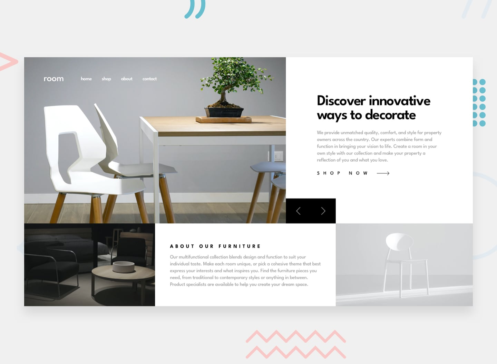

# Room Homepage

A responsive and interactive **Room Homepage** built with modern frontend practices.

Built with **React and Tailwind CSS**, focusing on **responsive layout, component-based architecture, dynamic data rendering, interactive navigation, and smooth UI animations**.

This project is inspired by a **Frontend Mentor challenge**.



---

## Live Demo

https://roomhomepage-topaz.vercel.app/

---

## Features

### Responsive Header & Navigation

- Responsive navigation for mobile and desktop
- Mobile navigation menu with open/close functionality
- Animated mobile menu transition
- Dark overlay when the mobile menu is open
- Navigation links with animated hover effects
- Responsive Room logo placement

---

### Hero Slider

- Dynamic hero slider rendered from data
- Previous and next slide controls
- Circular slide navigation
- Separate mobile and desktop images using `<picture>`
- Dynamic slide titles and descriptions
- Smooth fade transition between slides
- Responsive hero layout

---

### About Section

- Responsive three-column layout on larger screens
- Separate dark and light furniture images
- Responsive image sizing with `object-cover`
- Responsive typography and spacing
- Semantic content structure

---

### User Experience

- Smooth hover transitions
- Animated navigation interactions
- Interactive mobile navigation
- Responsive layouts across different screen sizes
- Clear visual hierarchy and typography
- Mobile-first approach

---

## Technologies Used

### React / JavaScript

- Functional components
- `useState` for navigation and slider state
- Event handling
- Component-based architecture
- Dynamic rendering with `map()`
- Data-driven slide and navigation content

---

### Tailwind CSS

- Utility-first styling
- Responsive breakpoints
- CSS Grid and Flexbox
- Positioning and overlays
- Responsive typography
- Hover effects
- CSS transitions and animations
- Responsive image layouts

---

## Project Structure

```text
src/
├── assets/
│   ├── images/
│   └── icons/
│
├── components/
│   ├── Navbar.jsx
│   ├── Header.jsx
│   └── About.jsx
│
├── data.js
│   
│
├── App.jsx
├── App.css
└── main.jsx