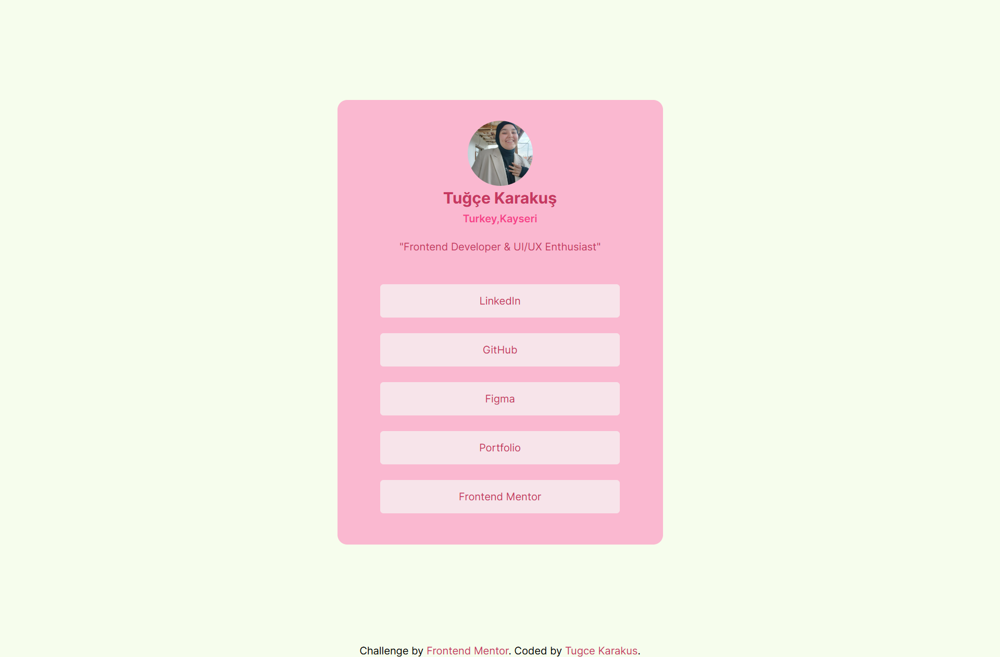

# Social Links Profile

This is a solution to the [Social Links Profile challenge](https://www.frontendmentor.io/challenges/social-links-profile-UG32l9m6dQ) on Frontend Mentor.  
Frontend Mentor challenges help you improve your coding skills by building realistic projects.  

---

## 🚀 Overview

This project is a simple **social profile card** with links to different platforms.  
It was built with **HTML** and **CSS** using custom styles and responsive design techniques.

---

## 🔗 Links

- [Frontend Mentor Solution Page](https://www.frontendmentor.io/profile/tugcekarakuss)  
- [Live Site](https://tugcekarakus.vercel.app)  

---

## 🛠️ Built With

- Semantic **HTML5**
- **CSS3** (Flexbox, custom properties, responsive units)
- Custom font with `@font-face`

---

## 🎨 Customization

The original challenge provided a base design, and I personalized it with:  
- 👤 My own personal details (name, location, job title)  
- 🔗 Links to my own profiles (LinkedIn, GitHub, Figma, Portfolio, Frontend Mentor)  
- 🎨 A custom color palette using CSS variables  
- 🔤 A custom font setup (`@font-face` with Inter)  
- ✨ Extra improvements like `clamp()`, `transition`, and responsive tweaks  

---

## 📚 What I Learned

- How to use CSS variables (`:root`) for consistent theming  
- Improving responsive typography with `clamp()`  
- Making links fully clickable by using `display: block` on `<a>` elements  
- Cleaner spacing using Flexbox and the `gap` property  
- The importance of semantic HTML for better accessibility  

---

## 🙌 Acknowledgments

Thanks to [Frontend Mentor](https://www.frontendmentor.io) for providing this challenge.  

---
